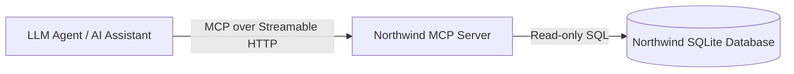
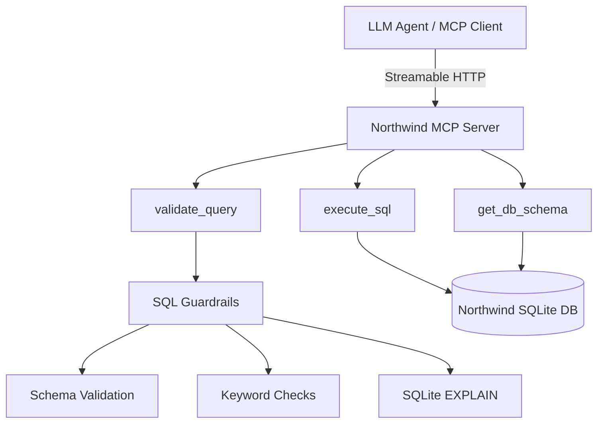

# Northwind MCP Server

[]()
[]()
[]()
[]()
[]()
[]()
[]()

## Overview

This project is a reference implementation of a secure Model Context Protocol (MCP) server that enables safe, read-only SQL access to the classic Northwind SQLite3 database for LLM agents.

It demonstrates multi-layered SQL validation, schema-aware guardrails, and defensive AI-to-database interaction.

## Features

* MCP Tool Interface – Exposes tools over Streamable HTTP for modern LLM agents.
* Safe SQL Execution – Enforces SELECT-only queries with multi-layer validation.
* Schema-Aware Guardrails – Prevents invalid or hallucinated tables/columns.
* Preflight Validation – Uses SQLite EXPLAIN to verify queries before execution.
* Read-Only Database Mode – Guarantees no data mutation.
* Layered Design – Clear separation between tool handling, validation, and execution.
* Comprehensive Tests – Unit and Integration tests to ensure coverage of core logic.

## Exposed MCP Tools

| Tool             | Description                                 |
| ---------------- | ------------------------------------------- |
| `get_db_schema`  | Returns all tables and columns              |
| `validate_query` | Validates SELECT query safety and structure |
| `execute_sql`    | Executes a validated SELECT query           |

## Tech Stack

*   **[MCP](https://modelcontextprotocol.io) (via FastMCP)**: Defines and exposes structured tools for LLM interaction over Streamable HTTP.
*   **[SQLite3](https://www.sqlite.org) (Read-Only mode)**: Lightweight database used to demonstrate safe, immutable query execution.
*   **[sqlparse](https://sqlparse.readthedocs.io)**: Parses and validates SQL structure. Ensures: Single statement, SELECT-only.
*   **[Pydantic v2](https://docs.pydantic.dev)**: Provides strict, typed response models for tool outputs.
*   **[uv](https://docs.astral.sh)**: Manages dependencies with deterministic lockfiles for reproducible builds.
*   **[Pytest](https://docs.pytest.org) (+ AnyIO)**: Used for unit and integration tests with async support and coverage reporting.

## Architecture

### System Context

Below flowchart shows how Northwind MCP server fits into a larger ecosystem.



**Description**

* The LLM Agent communicates via the Model Context Protocol (Streamable HTTP transport).
* The MCP Server acts as a secure boundary.
* The SQLite database is never directly exposed to the agent.

This enforces proper isolation between AI reasoning and data execution.

### Logical Overview

The server sits between an MCP-compatible agent and the SQLite database, enforcing strict validation before execution.



## Project Structure

```
northwind-mcp/
│
├── pyproject.toml              # Project configuration
├── uv.lock                     # Deterministic dependency lockfile
├── requirements.txt            # Runtime dependencies
├── requirements-dev.txt        # Development dependencies
├── .python-version             # Python version pin
├── README.md                   # Project documentation
│
├── northwind_mcp/              # Application package
│   ├── __init__.py
│   ├── main.py                 # ASGI entrypoint (Streamable HTTP app)
│   ├── server.py               # MCP tool definitions
│   ├── connection.py           # SQLite3 connection handling
│   ├── logging_config.py       # Logging configuration
│   │
│   ├── models/
│   │   └── schema.py           # Pydantic response models
│   │
│   ├── utils/
│   │   └── utils.py            # Utility functions
│   │
│   └── data/                   # SQLite3 DB file (Northwind DB to be copied here)
│
└── tests/
    ├── conftest.py             # Shared test fixtures
    ├── unit/                   # Unit test cases
    └── integration/            # Integration test cases

```

## Setup Instructions

### 1. Clone the repository

After cloning, switch to the project root directory in terminal.
```bash
cd northwind-mcp
```

### 2. Install dependencies

#### Option 1 — Using `uv` (recommended)
```bash
uv sync
```
For development dependencies:
```bash
uv sync --group dev
```

#### Option 2 — Using `pip`
```bash
pip install -r requirements.txt
pip install -r requirements-dev.txt  # For development dependencies
```

### 3. Download the Northwind SQLite Database

The database file is intentionally excluded from version control to keep the repository lightweight.

Download it from: https://github.com/jpwhite3/northwind-SQLite3.

After downloading, copy the `northwind.db` file into directory:
```bash
northwind_mcp/data/
```

Following `curl` command can be used to download and save the db file:

```bash
curl -fsSL -o northwind_mcp/data/northwind.db \
https://raw.githubusercontent.com/jpwhite3/northwind-SQLite3/main/dist/northwind.db
```

### 4. Running the MCP Server

**NOTE:** Logging level configuration can be controlled with environment variable `LOG_LEVEL` (defaults to `INFO` if not provided).

#### Option 1 — Python module
```bash
export LOG_LEVEL=WARNING
python -m northwind_mcp.main
```

### Option 2 — Uvicorn directly
```bash
export LOG_LEVEL=DEBUG
uvicorn northwind_mcp.main:app --host 127.0.0.0 --port 9001
```

The MCP server will run on: `http://localhost:9001`

The Streamable HTTP endpoint will be available at:
```bash
http://localhost:9001/mcp
```

*(Note: Depending on the FastMCP configuration, the server may also respond directly at the root /)*

## Running tests

### Unit tests:
Run using uv:
```bash
uv run pytest -m unit
```
or
```bash
pytest -m unit
```

Coverage report will be generated automatically.

<details>
<summary>Sample Coverage Output (100%)</summary>

```bash
uv run pytest -m unit

==============================================================
test session starts
==============================================================
platform darwin -- Python 3.12.1, pytest-9.0.2, pluggy-1.6.0
rootdir: /Users/....../....../northwind-mcp
configfile: pyproject.toml
testpaths: tests
plugins: anyio-4.12.1, mock-3.15.1, cov-7.0.0
collected 33 items / 15 deselected / 18 selected                                                                                     

tests/unit/test_connection.py ...
tests/unit/test_execute_sql.py ...
tests/unit/test_get_db_schema.py ..
tests/unit/test_validate_sql.py ..........

==============================================================
tests coverage
==============================================================
__________________________________________________
coverage: platform darwin, python 3.12.1-final-0
__________________________________________________

Name                             Stmts   Miss  Cover   Missing
--------------------------------------------------------------
northwind_mcp/__init__.py            0      0   100%
northwind_mcp/connection.py          8      0   100%
northwind_mcp/models/schema.py      13      0   100%
northwind_mcp/server.py             97      0   100%
northwind_mcp/utils/utils.py         9      0   100%
--------------------------------------------------------------
TOTAL                              127      0   100%
=================================================
18 passed, 15 deselected in 0.17s
==================================================
```
</details>


### Integration tests (requires running server):
Run using uv:
```bash
uv run pytest -m integration
```
or
```bash
pytest -m integration
```

or 
Run using uv:
`uv run pytest -m unit`

## Using MCP Inspector

Official MCP Inspector UI can be used to interact with the Northwind MCP server.

### Start the MCP Server

From project root:
```bash
uv run python -m northwind_mcp.main
```

By default, the server runs at:
```bash
http://localhost:9001/mcp
```

### Start MCP Inspector

In a separate terminal:
```bash
npx @modelcontextprotocol/inspector
```

Start-up output similar to the below should be seen:
```bash
Starting MCP inspector...
Proxy server listening on localhost:6277
Session token: <token>

MCP Inspector is up and running at:
http://localhost:6274/?MCP_PROXY_AUTH_TOKEN=<token>
```

### Open the MCP Inspector UI
* Open the MCP Inspector URL in browser
* Set Transport Type to: `Streamable HTTP`
* Enter the MCP server URL: `http://localhost:9001/mcp`
* Click on Connect
* Connection to `NorthwindMCP` should be established
* Go to `Tools` section and `List Tools`
* Tools should be listed
* Continue with testing the tools by providing input and verifying the output


## MCP Integration

This server is compatible with:
* MCP-compatible LLM agents
* FastMCP clients
* Any MCP client supporting Streamable HTTP transport

## LLM Instructions

This server is designed for LLMs to follow a Validate-then-Execute pattern:
1. Discover: Call `get_db_schema` to understand the db schema.
2. Validate: Call `validate_query` to check for syntax or security errors.
3. Execute: Call `execute_sql` only after validation returns `valid: true`.
